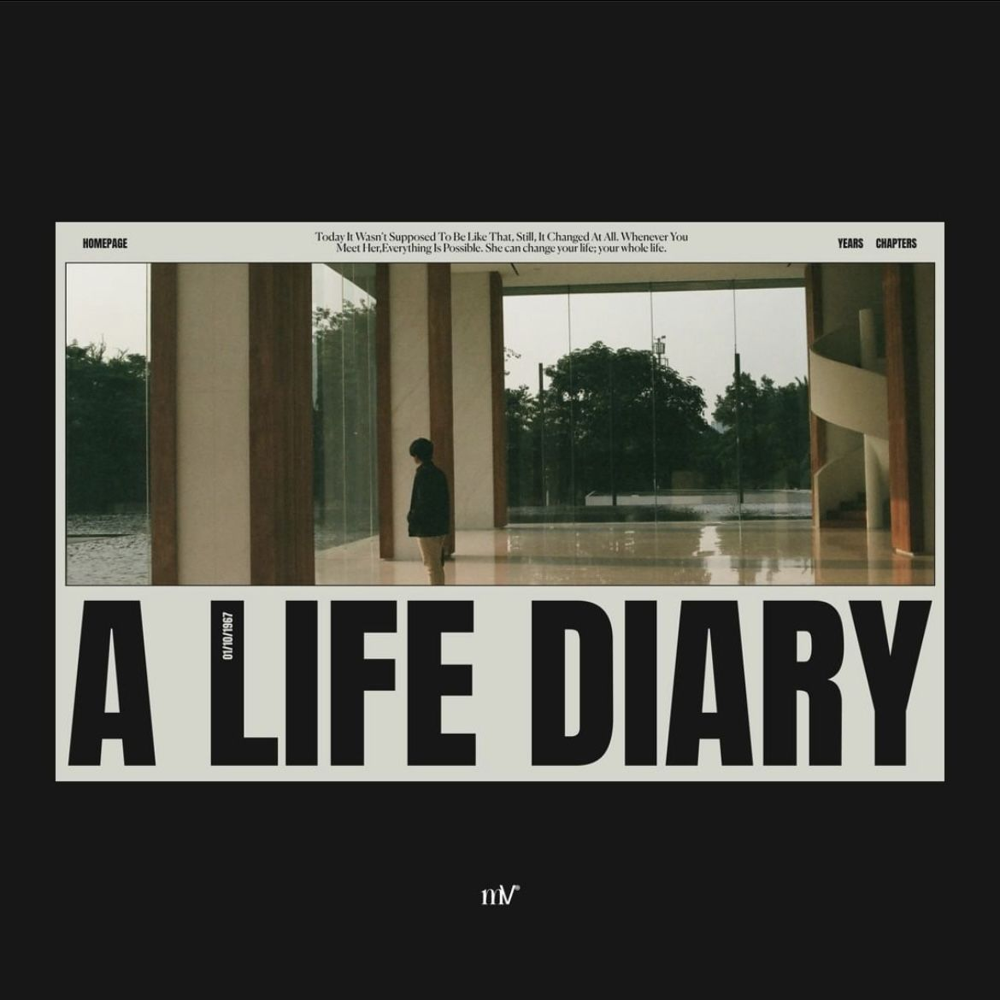
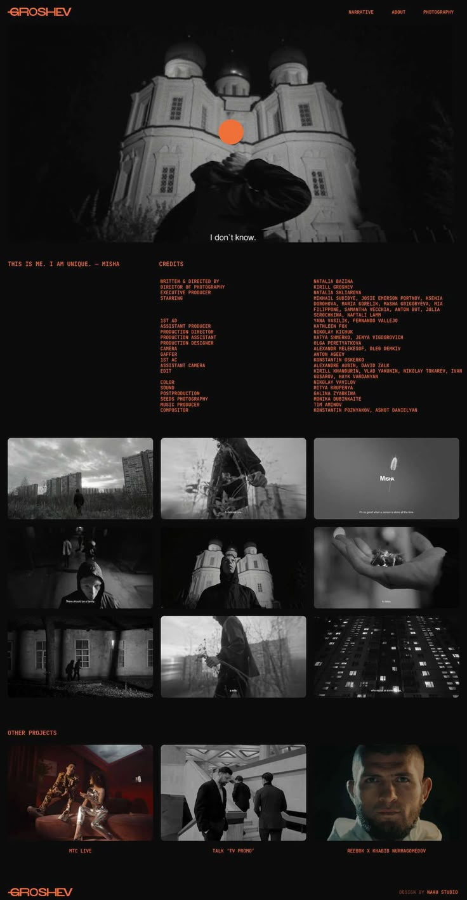
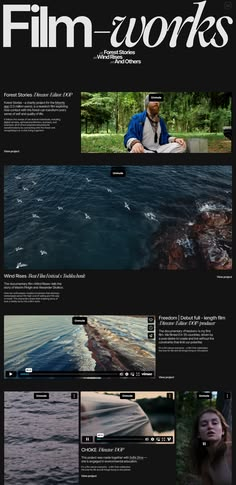
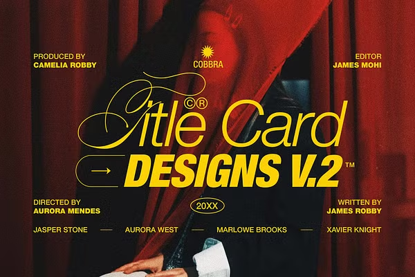
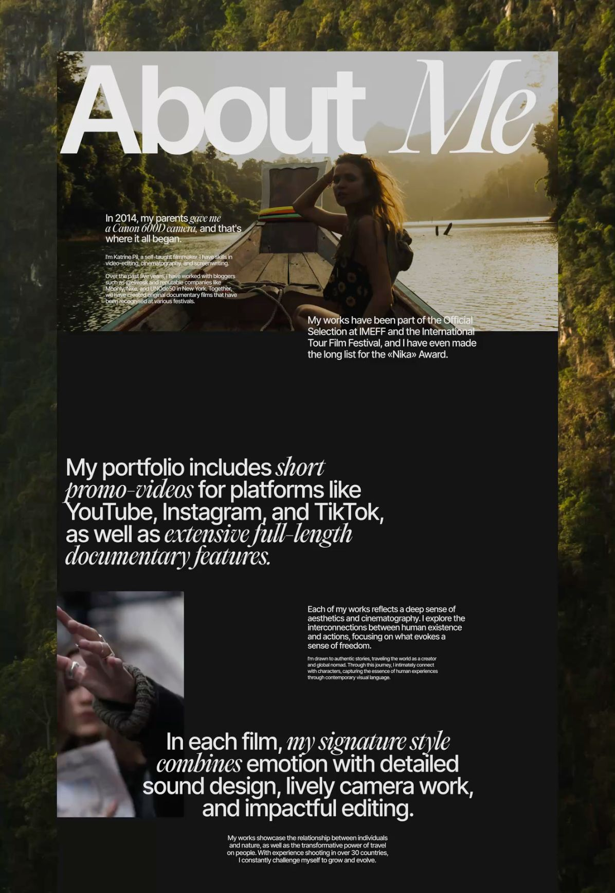

# film site inspo

Web-design references for the film portfolio (see
[FILM_SITE_PLAN.md](../../FILM_SITE_PLAN.md)). Collected 2026-08-13.

Not to be confused with the drive's `INSPO.md`, which is **trial reel**
inspo — editing techniques to replicate. This file is about how the *site*
looks, not how the footage is cut.

Files are numbered by influence: `01` is the lead reference, `02`–`05` are
supporting. Images are kept out of `public/` on purpose — they're other
people's design work, so they're for reference, not for serving.

---

## 01 — "A Life Diary" — the lead reference

**Chosen 2026-08-13.** PJ: *"this is similar to what im looking for. simple.
cinematic. clean."*

This is the only reference that resolves the dark-vs-paper question instead
of picking a side, which is why it leads:

- **Near-black outer canvas** (~`#0F0F0F`) with a **bone-paper card** floating
  inside it, generous margin on all four sides. The card is the page; the dark
  is the room it hangs in.
- **Tiny centered running header** in a serif, Title Case, two lines, set as a
  fragment of prose rather than a tagline.
- **Uppercase mono nav pinned to the card's corners** — `HOMEPAGE` left,
  `YEARS  CHAPTERS` right. Tiny, letterspaced, no underlines.
- **Framed 16:9 still** inset within the card, hairline gap to the card edge.
- **Massive condensed grotesque title** below the image, uppercase, tight
  tracking, optically flush to the card's left and right edges.
- **Rotated date stamp** (`01/10/1967`) set vertically, tucked into the gap
  between the title's first two letters. Mono, tiny.
- **Small monogram** centered below the card, on the dark.

**What to take:** the whole structure. Card-in-dark, corner mono nav, serif
running header, huge condensed title, rotated date stamp.

**What to adapt:** the reference is one still on a light grey grade. Our
footage is night-lit neon — parking garage, pink interior, purple party
lighting — so framed stills will read much hotter against bone paper. Handle
with the hairline frame and a little breathing room, don't fight it.

---

## 02 — Groshev (narrative film site, by Naau Studio)

- All near-black, single **hot orange accent** used for the wordmark, nav, and
  section labels only — never for body text.
- **Credits treated as the main design element**: two-column mono, role in
  accent on the left, names in white on the right, long and unabridged.
- Subtitle line pulled out of the film and set centered under the hero as a
  quote (`I don't know.`).
- **3-across still grid**, full-bleed-ish, with in-frame subtitles left intact.
- `OTHER PROJECTS` row at the bottom with captions beneath, mono uppercase.

**What to take:** the credits block, and the discipline of exactly one accent.
This is the closest reference to what a *finished film's* page should contain.

---

## 03 — "Film–works" index

- Dark canvas, oversized **serif + italic** masthead (`Film–works`) with small
  metadata set tight against it.
- Work index as **stacked rows**: title, small descriptive paragraph, and a
  16:9 video thumbnail per row, alternating alignment.
- Each entry carries its own role credit (`Director, Editor, DOP`) inline.

**What to take:** the row-based index. Works well with a *short* catalog —
two entries look deliberate rather than sparse, which is exactly our problem.

---

## 04 — "Title Card Designs V.2"

- **Italic serif + heavy condensed sans in one headline** (`Title Card` /
  `DESIGNS V.2`), layered over full-bleed photography.
- **Credits pinned to all four corners** like an actual title card —
  `PRODUCED BY`, `EDITOR`, `DIRECTED BY`, `WRITTEN BY` — with a cast row along
  the bottom separated by em dashes.
- Warm **yellow accent** on a red/dark frame; small circled year (`20XX`) and
  trademark/registered marks used as texture.

**What to take:** the corner-pinned credit layout as an option for the film
page's title treatment. Also the small-caps mark details (`©`, `™`, circled
year) as texture.

**Why it doesn't lead:** it's a poster, not a site. Great for one hero moment,
doesn't give you a system for process sections.

---

## 05 — Katrine Pil "About Me"

- Full-bleed photography behind a dark content slab.
- **Mixed serif-italic and grotesque in the same sentence** at very large
  size, used as the primary storytelling device.
- Deliberate **three-tier text hierarchy**: huge statement, medium supporting
  paragraph, tiny dense detail paragraph.
- Festival/selection credits set as plain running prose, not badges.

**What to take:** the type-mixing for the about page, and the three-tier
hierarchy. Note it's the only reference here that's a *filmmaker bio* rather
than a film or index page.
